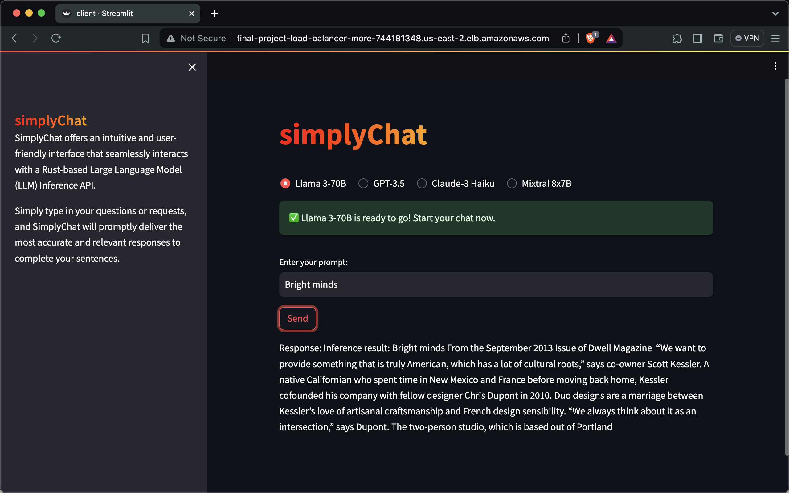

# simplyChat 💬
[][def]
[][def]
[](https://www.rust-lang.org/)
[](https://streamlit.io/)
[](https://www.docker.com/#build)
[](https://aws.amazon.com/)
[](https://kubernetes.io/)

# Rust Serverless Transformer Endpoint

This project demonstrates how to deploy an open-source language model on AWS using Docker. It utilizes Hugging Face's transformer models in Rust to provide an NLP service via a Streamlit frontend.

## Features

* Utilizes **Rust** for high-performance and reliable backend services.

* Serverless Deployment: Leverages **AWS Fargate** for serverless deployment, reducing operational overhead.

* **Docker** Integration: Encapsulates the application within a Docker container for consistent development, testing, and production environments.

## Testing the project locally

* Run:
```bash
docker compose up
```

* Access Streamlit frontend by following the [link](http://localhost:8501/).

## AWS Deployment
* The Github Actions' jobs build and upload the Docker images to AWS ECR on push to main.
* The task used for defining a service for a cluster uses the images.
* The images are connected by a private network with each other and by AWS Fargate (mediated by a load balancer) with the Web.

## Video explanation
[The link to the video](video/video.mp4)

## Screenshots
### Running the model


## For evaluators
[The link to the AWS hosted model](http://final-project-load-balancer-more-744181348.us-east-2.elb.amazonaws.com)