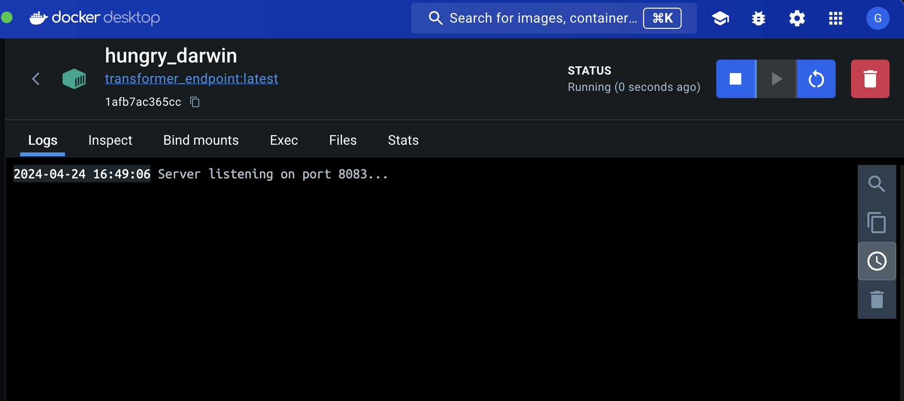
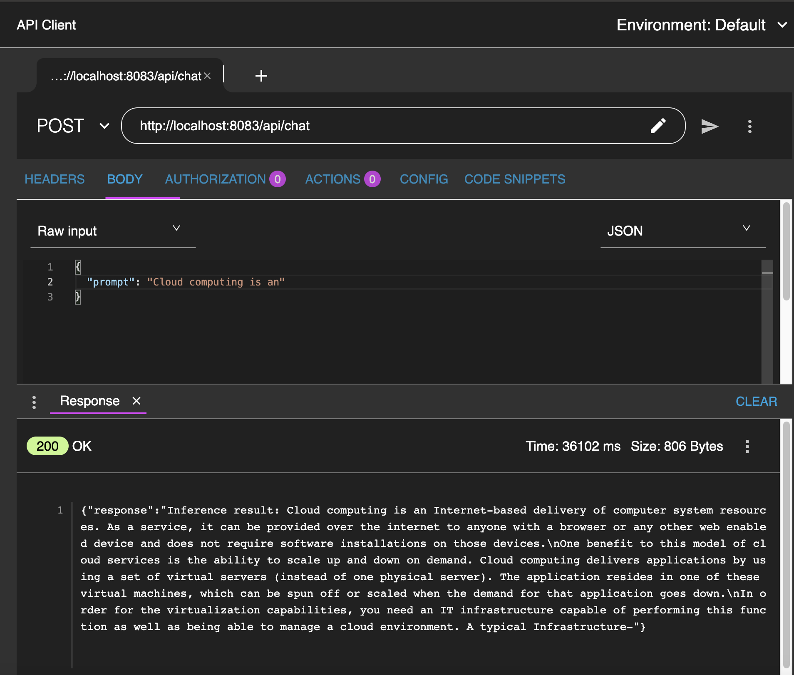
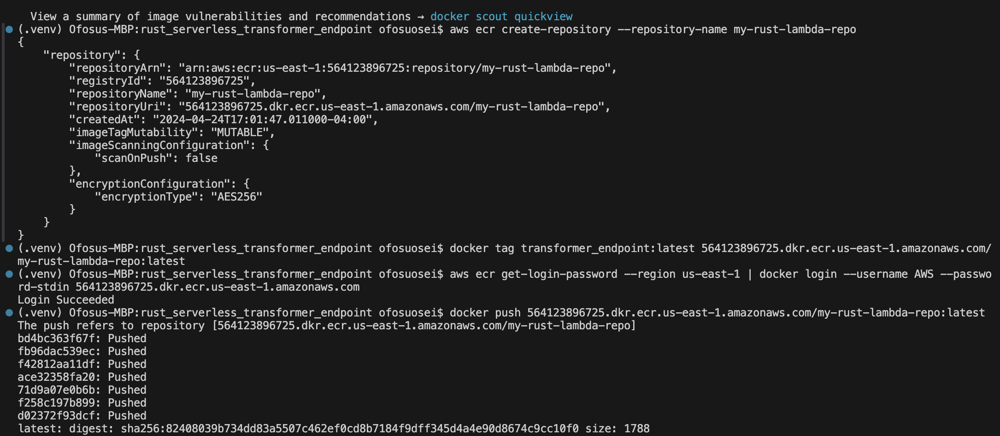
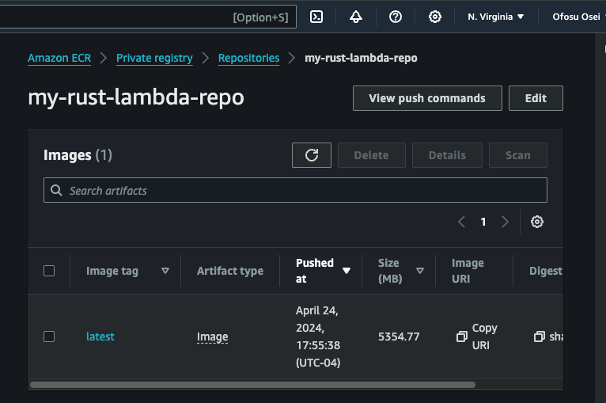
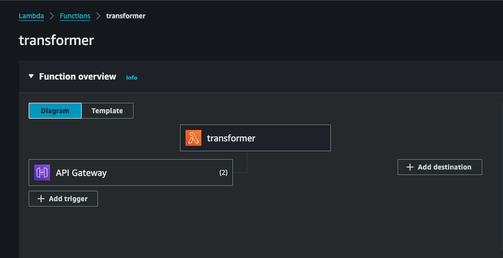
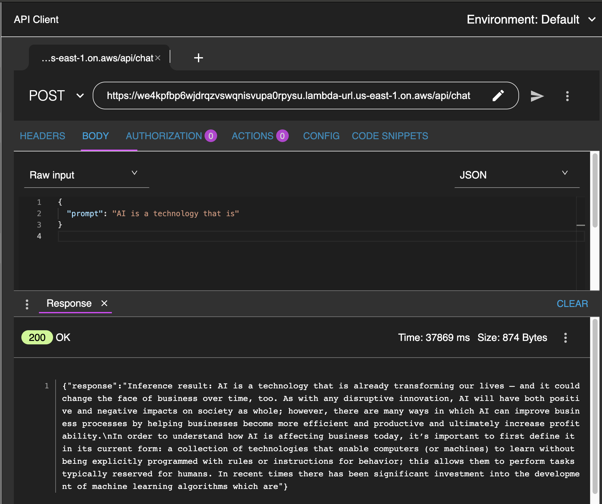

# simplyChat 💬
[][def]
[][def]
[](https://streamlit.io/)
[](https://aws.amazon.com/)

# Rust Serverless Transformer Endpoint

This project demonstrates how to build and deploy a Rust-based serverless application on AWS Lambda using Docker. It utilizes Hugging Face's transformer models to provide an NLP service via a RESTful API, accessible through AWS API Gateway.

## Features

* Rust Language: Utilizes Rust for high-performance and reliable backend services.

* Serverless Deployment: Leverages AWS Lambda for serverless deployment, reducing operational overhead.

* Docker Integration: Encapsulates the application within a Docker container for consistent development, testing, and production environments.

* API Gateway: Exposes a RESTful API endpoint via AWS API Gateway, making the service accessible over HTTP.

## Prerequisites

* AWS CLI - Configured with administrator access.
* Docker - For building and pushing Docker images.
* Rust - Latest stable version.
* Cargo-lambda - For building AWS Lambda compatible binaries.

## Installation

* Clone the Repository
```bash
git clone https://gitlab.com/Ofosu-Osei/rust_serverless_transformer_endpoint.git
cd rust_serverless_transformer_endpoint
```

## Build the Docker Image
```bash
docker build -t transformer_endpoint .
```




## Testing Locally



## Push the Docker Image to Amazon ECR





## Create Function from image and API Gateway Using AWS GUI

* Follow the AWS Console or CLI instructions to set up an API Gateway that triggers the Lambda function.



## Live Testing



## Acknowledgments

* Hugging Face team for their incredible transformer models [download](https://huggingface.co/rustformers/open-llama-ggml/tree/main)

* AWS documentation for clear guidelines on using AWS Lambda and API Gateway.

*  Credit to [AIAnytime](https://github.com/AIAnytime/LLM-Inference-API-in-Rust/blob/main/language_model_server/src/main.rs) for the inspirational code example.

[def]: https://github.com/johnnymosby/cloud_final_project/actions/workflows/docker-image-frontend.yml
[def]: https://github.com/johnnymosby/cloud_final_project/actions/workflows/docker-image-backend.yml